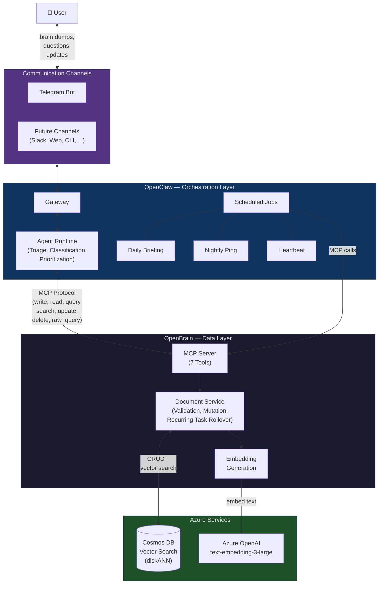
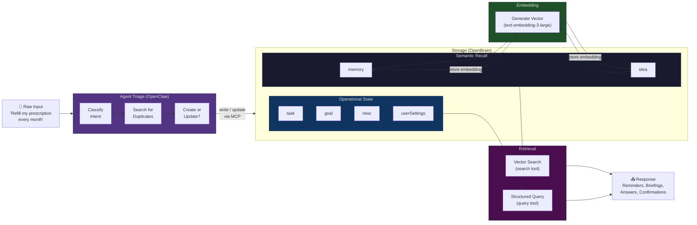

# OpenBrain Architecture Diagrams

## System Architecture

```mermaid
graph TB
    User["👤 User"]

    subgraph channels["Communication Channels"]
        Telegram["Telegram Bot"]
        Future["Future Channels<br/>(Slack, Web, CLI, ...)"]
    end

    subgraph openclaw["OpenClaw — Orchestration Layer"]
        Gateway["Gateway"]
        Agent["Agent Runtime<br/>(Triage, Classification,<br/>Prioritization)"]
        Cron["Scheduled Jobs"]
        DB["Daily Briefing"]
        NP["Nightly Ping"]
        HB["Heartbeat"]
        Cron --- DB
        Cron --- NP
        Cron --- HB
    end

    subgraph openbrain["OpenBrain — Data Layer"]
        MCP["MCP Server<br/>(7 Tools)"]
        Embed["Embedding<br/>Generation"]
        Service["Document Service<br/>(Validation, Mutation,<br/>Recurring Task Rollover)"]
    end

    subgraph azure["Azure Services"]
        Cosmos[("Cosmos DB<br/>Vector Search<br/>(diskANN)")]
        AOAI["Azure OpenAI<br/>text-embedding-3-large"]
    end

    User <-->|"brain dumps,<br/>questions,<br/>updates"| channels
    channels <--> Gateway
    Gateway <--> Agent
    Agent <-->|"MCP Protocol<br/>(write, read, query,<br/>search, update,<br/>delete, raw_query)"| MCP
    Cron -->|"MCP calls"| MCP
    MCP --> Service
    Service --> Embed
    Embed -->|"embed text"| AOAI
    Service <-->|"CRUD +<br/>vector search"| Cosmos

    style openbrain fill:#1a1a2e,stroke:#16213e,color:#e0e0e0
    style openclaw fill:#0f3460,stroke:#16213e,color:#e0e0e0
    style channels fill:#533483,stroke:#16213e,color:#e0e0e0
    style azure fill:#1e5128,stroke:#16213e,color:#e0e0e0
```

## Data Flow

```mermaid
graph LR
    Input["💬 Raw Input<br/>'Refill my prescription<br/>every month'"]

    subgraph triage["Agent Triage (OpenClaw)"]
        Classify["Classify<br/>Intent"]
        Search["Search for<br/>Duplicates"]
        Decide["Create or<br/>Update?"]
        Classify --> Search --> Decide
    end

    subgraph store["Storage (OpenBrain)"]
        direction TB
        subgraph semantic["Semantic Recall"]
            Memory["memory"]
            Idea["idea"]
        end
        subgraph operational["Operational State"]
            Task["task"]
            Goal["goal"]
            Misc["misc"]
            Settings["userSettings"]
        end
    end

    subgraph embed["Embedding"]
        Vec["Generate Vector<br/>(text-embedding-3-large)"]
    end

    subgraph recall["Retrieval"]
        VectorSearch["Vector Search<br/>(search tool)"]
        StructuredQuery["Structured Query<br/>(query tool)"]
    end

    Output["📤 Response<br/>Reminders, Briefings,<br/>Answers, Confirmations"]

    Input --> triage
    Decide -->|"write / update<br/>via MCP"| store
    Memory & Idea --> Vec
    Vec -->|"store embedding"| Memory & Idea
    semantic --> VectorSearch
    operational --> StructuredQuery
    VectorSearch & StructuredQuery --> Output

    style semantic fill:#1a1a2e,stroke:#16213e,color:#e0e0e0
    style operational fill:#0f3460,stroke:#16213e,color:#e0e0e0
    style triage fill:#533483,stroke:#16213e,color:#e0e0e0
    style embed fill:#1e5128,stroke:#16213e,color:#e0e0e0
    style recall fill:#4a0e4e,stroke:#16213e,color:#e0e0e0
```
