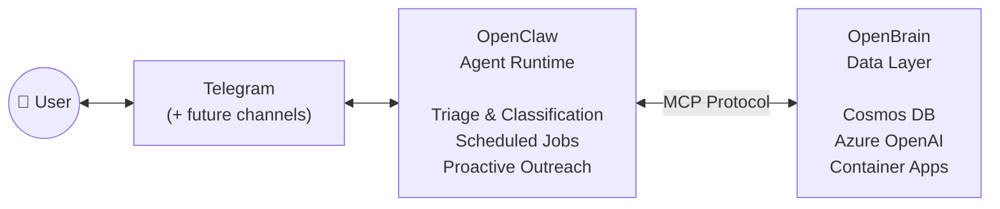
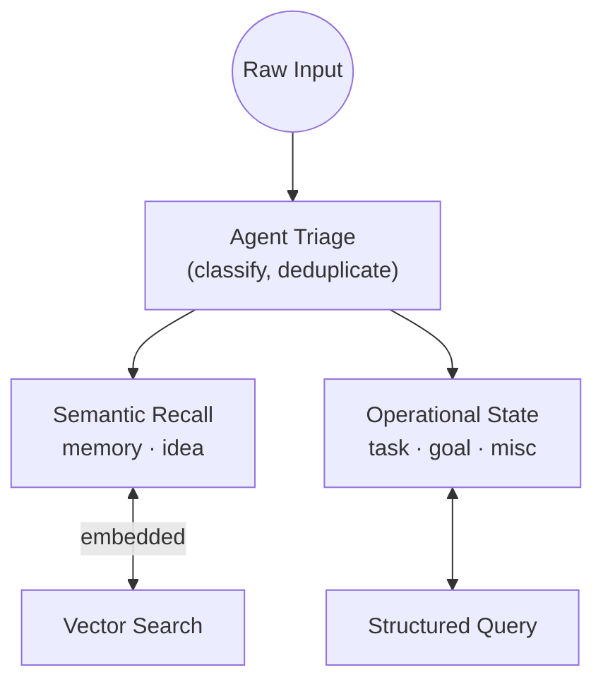

# openbrain

OpenBrain is an AI-native second brain — an MCP server on Azure for capturing and retrieving personal knowledge, ideas, goals, and tasks without heavy manual organization.

## Why This Exists

Most second-brain tools are passive archives. You put things in and hope you remember to look. OpenBrain is designed to be active — it captures, organizes, recalls, tracks, coaches, and prompts.

At the highest level, OpenBrain exists to do six things:

1. **Capture** — get facts, ideas, goals, and tasks out of your head with very little friction.
2. **Organize** — keep stored information coherent over time through classification, cleanup, and lightweight structure.
3. **Recall** — answer natural-language questions about what you have previously captured.
4. **Track** — maintain operational state for one-time tasks, recurring tasks, and goals.
5. **Coach** — help you make progress on important goals without turning the system into a rigid productivity app.
6. **Prompt** — provide useful proactive outreach such as reminders, stale-goal nudges, and planning support.

The intended product stance is:
- more active than a passive archive
- less intrusive than a nagging task manager
- useful as an organized assistant
- eventually capable of acting like a lightweight chief of staff

For detailed behavioral requirements and user journeys, see [USER_JOURNEYS.md](USER_JOURNEYS.md).

## How It Is Built

OpenBrain is an MCP server backed by Azure Cosmos DB with built-in vector search.

**Data store.** A single Cosmos DB container holds all documents, partitioned by user. Six document types — `memory`, `idea`, `task`, `goal`, `misc`, and `userSettings` — cover everything from factual recall to recurring task state to user preferences. The schema is flexible: unknown fields survive round-trip storage.

**MCP tool surface.** The server exposes exactly seven tools: `write`, `read`, `query`, `search`, `update`, `delete`, and `raw_query`. These are generic, document-shaped operations — not domain-specific endpoints. Any agent or client that speaks MCP can connect to the same brain.

**Embeddings and vector search.** `memory` and `idea` documents are embedded using Azure OpenAI's `text-embedding-3-large` model (3072 dimensions, cosine distance, diskANN index). The server generates embeddings internally — clients send text, never vectors. Semantic search is intentionally narrower than the full document store: tasks and goals are operational records handled through structured `query`, not vector search.

**Authentication.** Both Cosmos DB and Azure OpenAI authenticate via `DefaultAzureCredential` — no API keys in the system. Locally this resolves to `az login`; in Azure it resolves to system-assigned managed identity.

**Hosting.** The MCP server runs on Azure Container Apps with external HTTP ingress. It supports both `stdio` (local development) and `streamable-http` (hosted) transports.

For the full implementation contract — schemas, tool behavior, deployment details — see [DESIGN_SPEC.md](DESIGN_SPEC.md).

## How It Runs Today

The current phase uses a two-system architecture:

- **OpenBrain** — the data layer. Stores, embeds, queries, and mutates documents. Handles deterministic behavior like recurring-task rollover. Does not make business decisions.
- **OpenClaw** — the agent runtime. Owns the user gateway (a Telegram bot today), triage and classification, scheduled jobs (daily briefing, nightly ping, heartbeat), and proactive outreach.

The flow is straightforward: the user interacts with OpenClaw, OpenClaw calls OpenBrain's MCP tools for storage and retrieval, and any durable state remains anchored in OpenBrain. OpenClaw is the execution surface; OpenBrain is the canonical data contract.

This split is intentional for speed, cost, and time-to-production. It is not necessarily the final product shape.

For the full ownership table and flow details, see [RUNTIME_ARCHITECTURE.md](RUNTIME_ARCHITECTURE.md).

## Where It Is Going

Because the data layer exposes a standard MCP interface, the agent runtime is replaceable. Possible future directions include:
- consolidating into a single self-contained application that owns both data and agent runtime
- swapping the agent runtime for a different framework or platform
- adding new ingestion channels without changing the data layer

## Conceptual Model

OpenBrain separates semantic recall from operational state.

Semantic recall:
- `memory`: factual or reference information you want to recall later
- `idea`: speculative or generative thoughts worth revisiting later

Deterministic state:
- `goal`: long-running objectives
- `task`: concrete work items, either one-time or recurring
- `misc`: ambiguous captures preserved without forced classification
- `userSettings`: per-user configuration such as tag taxonomy and behavior preferences

Recurring tasks use two separate concepts:
- `recurrenceDays`: cadence
- `dueDate`: next upcoming occurrence

Marking a recurring task complete moves the next `dueDate` forward automatically.

Reminders are not a stored document type. They are external behavior layered on top of goals and tasks.

## Golden Rules

- The server is a data layer, not a decision maker. Classification, prioritization, cleanup, and reminder logic belong to agents and clients layered on top.
- The schema should stay flexible enough to preserve weird or incomplete input without breaking.
- The system should reduce friction, not add workflow burden.

This repository owns the MCP server, the Azure deployment surface, and the document model. It does not own:
- ingestion clients (Telegram or otherwise)
- external schedulers or orchestrators
- reminder delivery
- a human-facing UI

## Documentation Map

| Document | Role |
|---|---|
| [USER_JOURNEYS.md](USER_JOURNEYS.md) | User-facing and agent-facing expected behavior |
| [RUNTIME_ARCHITECTURE.md](RUNTIME_ARCHITECTURE.md) | Current OpenBrain vs OpenClaw ownership and flow boundaries |
| [DESIGN_SPEC.md](DESIGN_SPEC.md) | Implementation contract for architecture, schemas, and behavioral rules |
| [AGENT_OPERATING_MODEL.md](AGENT_OPERATING_MODEL.md) | Shared agent posture, authority boundaries, and reasoning-vs-determinism guide |
| [MCP_INTEGRATIONS.md](MCP_INTEGRATIONS.md) | Repo MCP configuration and local tooling setup |
| [CLAUDE.md](CLAUDE.md) | Claude repo operating rules |
| [AGENTS.md](AGENTS.md) | Codex repo operating rules |
| [.claude/hooks/README.md](.claude/hooks/README.md) | Claude hook wiring and purpose |
| [prompts/](prompts/) | Agent prompt templates (heartbeat, daily briefing, nightly ping) |

Code locations:
- [src/openbrain/models](src/openbrain/models): Pydantic document shapes
- [src/openbrain/services/document_service.py](src/openbrain/services/document_service.py): server-side document mutation and recurring-task behavior
- [src/openbrain/cosmos_client.py](src/openbrain/cosmos_client.py): Cosmos persistence and vector query behavior
- [tests/test_document_service.py](tests/test_document_service.py): focused business-logic tests
- [tests/test_scenarios.py](tests/test_scenarios.py): scenario coverage across document flows

Business logic flows from spec to code to tests: behavior rules belong in [DESIGN_SPEC.md](DESIGN_SPEC.md) first, then in `document_service.py`, then in tests.

This repo includes a checked-in `.mcp.json` for the local OpenBrain server, Azure MCP Server, and Microsoft Learn MCP Server. See [MCP_INTEGRATIONS.md](MCP_INTEGRATIONS.md) for details.

## Source of Truth Order

When there is tension between docs, use this order:

1. `README.md`
2. `USER_JOURNEYS.md`
3. `AGENT_OPERATING_MODEL.md`
4. `RUNTIME_ARCHITECTURE.md`
5. `DESIGN_SPEC.md`
6. runtime code in `src/openbrain/`
7. tests
